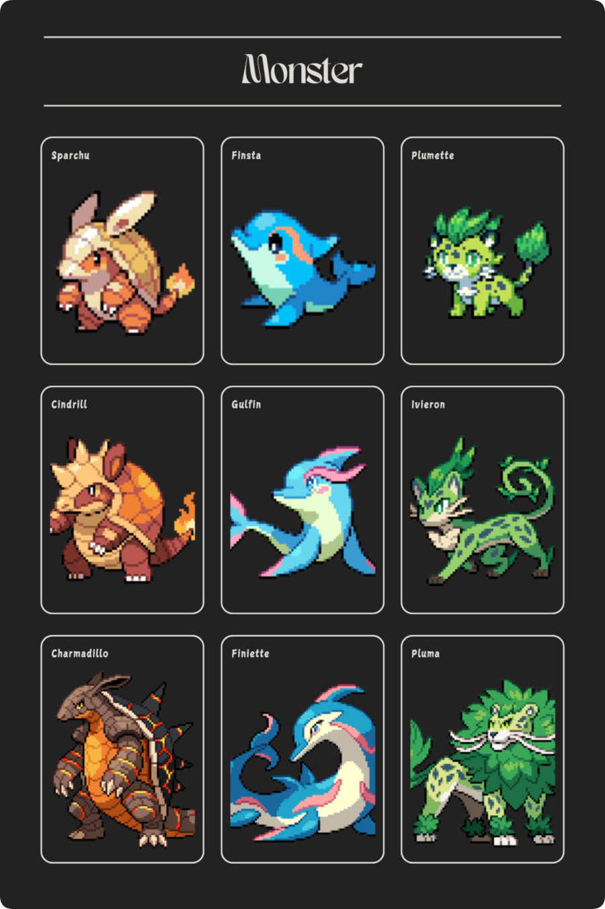
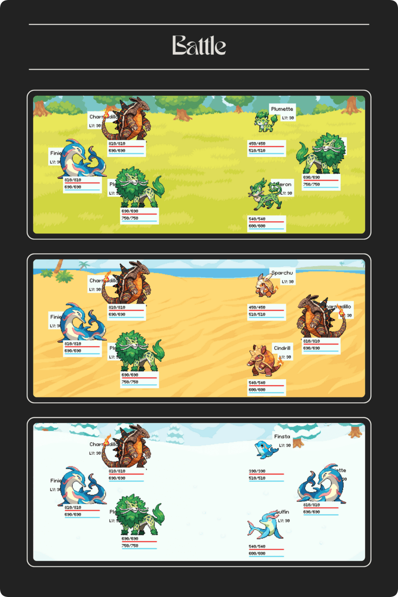

# POKEMON GAME INSPIRED RPG

    <em>
        Pokemon RPG invites you into an enthralling single-player adventure, where you take on the role of a budding Pokemon trainer. Roam a vast, lively world teeming with wild Pokemon, and dive into exhilarating battles as you build and train a powerful team. With its strategic combat system and intricate evolution mechanics, the game allows your Pokemon to grow stronger and evolve, unlocking their full potential as you progress on your epic journey.
    </em>

    <em>
        As you journey through the expansive world of Pokemon RPG, you'll meet captivating characters, take on thrilling quests, and uncover hidden mysteries. Engage in fierce battles against powerful trainers to test your skills and prove your worth. Build lasting relationships and lose yourself in the game’s stunning environments. With its dynamic gameplay and intricately crafted world, Pokemon RPG delivers an enriching and unforgettable role-playing adventure.
    </em>

    <em>
        Pokemon RPG is currently in the development and refinement phase, promising an engaging and immersive experience. While there are still areas needing enhancement, our team is committed to addressing these issues and elevating the game’s overall quality. We genuinely appreciate your patience and feedback as we work through this process. Stay tuned for exciting updates and new features as we move closer to completing this thrilling adventure.
    </em>

## 1. CHARACTER SYSTEM

    <em>
        The character system in this Pokemon RPG offers a variety of roles that each enhance your adventure in unique ways. Trainers deliver exhilarating battles that test your abilities and strengthen your team. Nurses are indispensable for maintaining your Pokemon's health, ensuring they are always in optimal condition for upcoming challenges. Moreover, specialized characters act as gym leaders for each Pokemon type, presenting significant challenges and defining key milestones in your journey. This rich array of characters elevates the gameplay experience, adding profound strategic depth and captivating immersion to your adventure.
    </em>

## 2. MONSTER SYSTEM

    <em>
        The Pokemon system in this RPG is both diverse and intricate, showcasing a broad spectrum of types, each with distinct strengths and weaknesses. Pokemon of varying types come equipped with unique abilities and moves, enabling strategic combinations in battle. Moreover, many Pokemon have the capacity to evolve into more formidable forms, boosting their stats and unlocking new abilities as they attain specific levels or fulfill certain conditions. This evolution system not only enhances the power of your Pokemon but also allows for a rich diversification of your team's skills, adding depth and engagement to the gameplay experience.
    </em>

## 3. BATTLE SYSTEM

    <em>
        The battle system in this Pokemon RPG offers a highly strategic experience, with varied environments designed for the distinct Pokemon types of each region. In combat, Pokemon can launch attacks, defend, or be strategically swapped to meet changing conditions. Players have the opportunity to capture wild Pokemon during battles, enhancing their team further. The Pokemon Index provides comprehensive management of stats and battle order, offering deeper control over team dynamics. This combination of strategic decisions, diverse settings, and real-time adaptability ensures that each battle remains engaging and exhilarating.
    </em>

